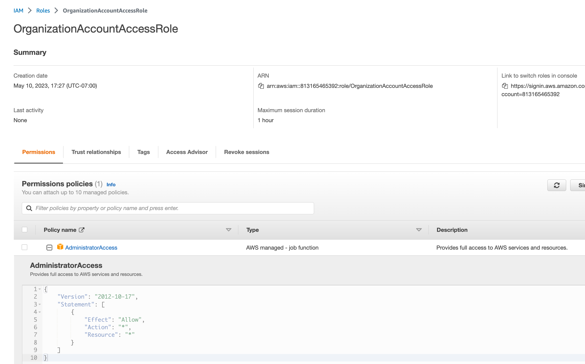
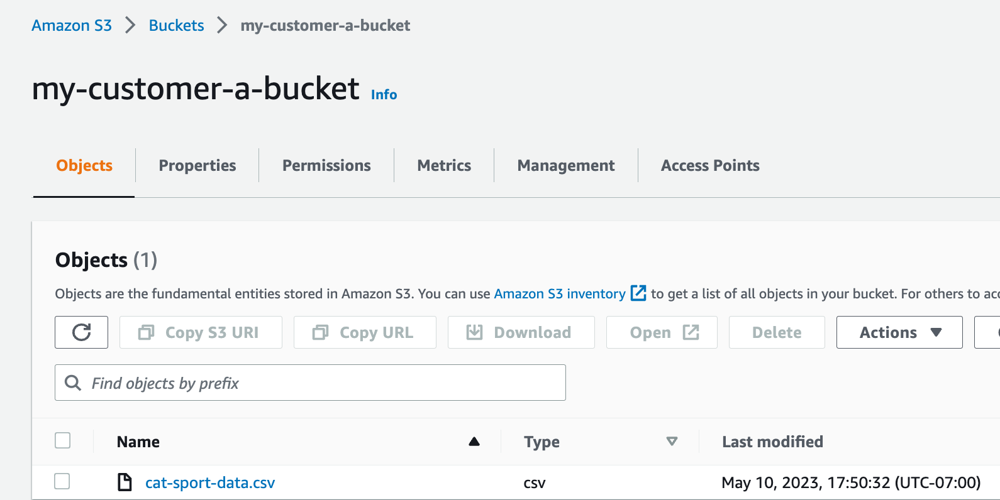
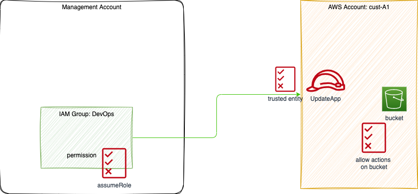

# AWS Organizations playgound

This repository is a sandbox to do some AWS Organizations studies with security control. 

This is related to the IAM tutorial about delegating access across AWS accounts using IAM roles, and some customer's inquiries.

An example of user story to address:

> As a user part of the `devops` group, I want to access resources, like logs, from potentially thousand, customer accounts dynamically created by our platform so that I can support end users.

## Requirements

* Create Organization with [AWS Organizations CLI](https://docs.aws.amazon.com/cli/latest/reference/organizations/index.html#cli-aws-organizations) from my main account. An AWS Organization is a collection of AWS accounts that you can manage centrally. Use all organization features.

    ```sh
    aws organizations create-organization
    # See existing org
    aws organizations describe-organization
    ```

* Build following AWS accounts structure within the main org:

    

    **Figure 1: Organizations of accounts into different classes of customer**

    ```sh
    aws organizations create-organization-unit --parent-id o-cyxzj... --name Class-A
    aws organizations create-organization-unit --parent-id o-cyxzj... --name Class-B
    ```

* Create the new AWS accounts in the organization we want to grant access to the group of users.

    ```sh
    aws organizations create-account --email userid+1@amazon.com --account-name cust-A1
    aws organizations create-account --email userid+2@amazon.com --account-name cust-A2
    aws organizations create-account --email userid+3@amazon.com --account-name cust-B1
    aws organizations create-account --email userid+3@amazon.com --account-name cust-B2
    aws organizations list-accounts 
    # move each accounts under the good OU with command like 
    aws organizations describe-organizational-unit --organizational-unit-id ou-kx...uif
    aws organizations move-account --account-id <value> --source-parent-id <value> --destination-parent-id <value>
    ```

    We can imagine to have thousand of accounts.

    AWS Organizations automatically creates an IAM role in the account that grants administrator permissions to any IAM users in the management account who can assume the role.

    

    We may remove this role or modify the policy to authorize only admin users from the management account.

* Be able to limit access to different accounts for group of user as in the following diagram:

    

* Create two groups of users in main account: `devops, developers`.

    ```sh
    aws iam create-group --group-name devops
    aws iam create-group --group-name developers
    aws iam list-groups
    ```

    Output:

    ```json
    {
    "Groups": [
        {
            "Path": "/",
            "GroupName": "developers",
            "GroupId": "AGPAV4D67BJ6CIQQ2HE3M",
            "Arn": "arn:aws:iam::4....6:group/developers",
            "CreateDate": "2022-10-13T14:21:46Z"
        },
        {
            "Path": "/",
            "GroupName": "devops",
            "GroupId": "AGPAV4D67BJ6DHBSM4TBI",
            "Arn": "arn:aws:iam::4...6:group/devops",
            "CreateDate": "2023-05-11T19:09:08Z"
        }
    ]
    }
    ```


* Add the users to the IAM Groups in the main AWS account

    ```sh
    aws iam create-user --user-name Ray
    aws iam create-user --user-name Bill
    aws iam add-user-to-group --user-name Ray --group-name developers
    aws iam add-user-to-group --user-name Bill --group-name devops
    # Verify 
    aws iam list-groups-for-user  --user-name Bill
    ```

* To be able to authorize access to resources within the different account we need to add role and policies. For example we have S3 bucket in cust-a account like:

    


    We need to define a set of security controls that can be summarized in the figure below:

    


    The IAM policy to control access to s3 bucket may look to at least the following declaration:

    ```json
    {
    "Version": "2012-10-17",
    "Statement": [
        {
            "Sid": "Statement1",
            "Effect": "Allow",
            "Action": "s3:ListAllMyBuckets",
            "Resource": "*"
        },
        {
            "Effect": "Allow",
            "Action": [
                "s3:ListBucket",
                "s3:GetBucketLocation"
            ],
            "Resource": "*"
        }
        ]
    }
    ```

    Create this policy under the `cust-*` account:

    ```sh
    # Be logged on specific account. 
    aws iam create-policy --policy-name s3-list --policy-document file://iam-res/s3-list.json
    ```

* Set up a trust relationship between the new account and the AWS account where the group of users are located. This allows the users to assume the IAM Role in the new account. For that modify the trusted entity policy (file `iam-res/trusted-entity.json`) with the management account ID:

    ```json
    {
    "Version": "2012-10-17",
    "Statement": [
        {
            "Effect": "Allow",
            "Principal": {
                "AWS": "arn:aws:iam::mgt_account_id:group/devops"
            },
            "Action": "sts:AssumeRole",
            "Condition": {}
        }
    ]
    }
    ```

    Create an IAM Role (account type) in the new accounts that allows access to the resources that the group of users needs to access.  The trusted account is the `main account` of the organization.
    
    ```sh
    # be sure to be logged in target account
    aws iam create-role --role-name UpdateApp --assume-role-policy-document file://iam-res/trusted-entity.json
    ```

    We can apply to other resources by adding content to the policy. But we can reach the policy size limit.

* Grant access to the Cross-Account IAM Role to the IAM Group that the group of users belong to.

    * Create an inline policy to modify the permission of the group:

    ```json
    {
    "Version": "2012-10-17",
    "Statement": {
        "Effect": "Allow",
        "Action": "sts:AssumeRole",
        "Resource": "arn:aws:iam::<custom-account-id>:role/UpdateApp"
        }
    }
    ```

    * Attach this inline policy to the needed group:

    ```sh
    aws iam put-group-policy --group-name devops --policy-document file://iam-res/permission.json --policy-name RemoteAccountAccess
    ```

### Testing the IAM solution

Need to test the follwing user story:

> As `Bill` user from the `devops` group, I want to list S3 bucket on the `cust-A1` accounts so that I can verify users in this account have uploaded files.

The test steps look like:

* Configure user to access AWS CLI and assume the role of the target account

    ```sh
    # with the user key in the .aws/config
    aws configure --profile Bill
    aws sts assume-role --role-arn "arn:aws:iam::<account-id-cust-A1>:role/UpdateApp" --role-session-name "Bill-Update"
    ```

    Output looks like:

    ```
    {
    "Credentials": {
        "AccessKeyId": "....",
        "SecretAccessKey": "...",
        "SessionToken": "FwoG1...3AAFlZ5c5I+HCGng==",
        "Expiration": "2023-05-12T00:35:36Z"
    },
    "AssumedRoleUser": {
        "AssumedRoleId": "AROA32VDQJ4YH62LBP4KS:Bill-Update",
        "Arn": "arn:aws:sts::813165465392:assumed-role/UpdateApp/Bill-Update"
    }
    }
    ```

* The output include access key, temporary token... To swap role we need to export those values as environment variables:

    ```sh
    export AWS_ACCESS_KEY_ID=
    ```

    ```sh
    export AWS_SECRET_ACCESS_KEY=
    ```

    ```sh
    export AWS_SESSION_TOKEN=
    ```

* Then `Bill` can execute the command on s3:

    ```sh
    aws s3 ls
    > 2023-05-10 17:45:37 my-customer-a-bucket
    ```

The other user story:

> As `Ray` in `developer` group I could not access to resources in `cust-A1` ot `cust-A2` account. 

This is supported as in the `developer` group there is no permission to assume the role of UpdateApp of those accounts. 

## Limitations of the IAM solution

There are constraints for the number of character in a policy. As accounts may be created automatically by IaC scripts and with a short life cycle, the permission on the group may be update each time the account is deleted. 

When the number of account grows to thousand the policy to add permission to the IAM group will grow in size, as there is one entry per target role in target account. 

```json
{
    "Version": "2012-10-17",
    "Statement": [
        {
            "Sid": "customer-1",
            "Effect": "Allow",
            "Action": "sts:AssumeRole",
            "Resource": "arn:aws:iam::81....2:role/UpdateApp"
        },
        {
            "Sid": "customer-2",
            "Effect": "Allow",
            "Action": "sts:AssumeRole",
            "Resource": "arn:aws:iam::40...76:role/UpdateApp"
        }, 
        .... thousand roles
    ]
}
```


## Using Service Control Policy in Organizations

SCPs may be attached to the root, Organization Unit or AWS accounts. Using SCPs we can be sure newly created account as general permission setup.  

* Be sure to have enabled SCP in the management account.
* Define a policy that let 

## Resources

* [IAM CLI for user and groups](https://docs.aws.amazon.com/cli/latest/userguide/cli-services-iam-new-user-group.html)
* [AWS Organizations CLI](https://docs.aws.amazon.com/cli/latest/reference/organizations/index.html#cli-aws-organizations).
* [IAM tutorial: Delegate access across AWS accounts using IAM roles](https://docs.aws.amazon.com/IAM/latest/UserGuide/tutorial_cross-account-with-roles.html).
* [Managing multi-account AWS env with Organization - re:Inforce 2019](https://www.youtube.com/watch?v=fxo67UeeN1A)
* [My summary of AWS security-Organizations.](https://jbcodeforce.github.io/aws-studies/infra/security/#aws-organizations)
* [SCP examples](https://docs.aws.amazon.com/organizations/latest/userguide/orgs_manage_policies_scps_examples_general.html)