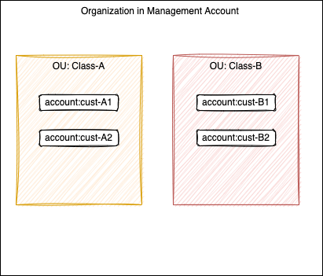

# AWS Organization playgound

This repository is a sandbox to do some AWS Organization play and security control. 

## Requirements

* Create Organization with [AWS organizations CLI](https://docs.aws.amazon.com/cli/latest/reference/organizations/index.html#cli-aws-organizations) from my main account. An AWS Organization is a collection of AWS accounts that you can manage centrally.

    ```sh
    aws organizations create-organization
    # See existing org
    aws organizations describe-organization
    ```
* Create two groups of users in main account: `devops, developers`.

    ```sh
    aws iam create-group --group-name devops
    aws iam create-group --group-name developers
    aws iam list-groups
    ```
* Add the group of users to an IAM Group in the AWS account
* Build following structure of AWS accounts within the main org:

    

* Create the new AWS accounts in the organization we want to grant access to the group of users.

    ```
    ```


* Be able to limit access to different account for group of user as in the following diagram:

    

* Create an IAM Role: Create an IAM Role in the new account that allows access to the resources that the group of users needs to access.
* Set up a trust relationship between the new account and the AWS account where the group of users are located. This allows the users to assume the IAM Role in the new account.
* Create a Cross-Account IAM Role in the AWS account where the group of users are located that allows them to assume the IAM Role in the new account.
* Grant access to the Cross-Account IAM Role to the IAM Group that the group of users belong to.